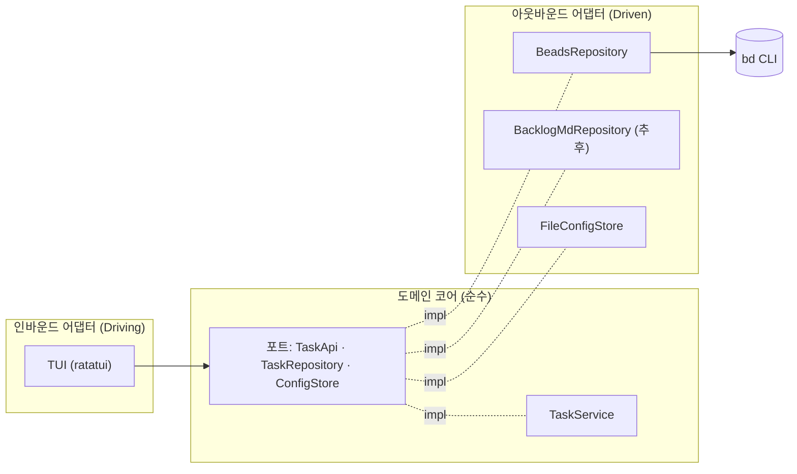

# taskr

> 외부 작업관리 인프라(beads, backlog.md 등) 위에서 동작하는 Rust 터미널 UI(TUI) 할 일 관리 클라이언트

`taskr`는 자체 저장소를 두지 않습니다. 데이터는 [beads](https://github.com/) · [backlog.md](https://backlog.md) 같은 외부 인프라에 저장되고, `taskr`는 그 위에서 빠른 키보드 중심의 CRUD UI를 제공합니다.

## 특징

- **백엔드 무관 (헥사고날 아키텍처)** — 도메인/유스케이스는 순수하게 유지하고, 각 인프라는 어댑터로 붙입니다. 새 백엔드 대응 = 어댑터 1개 추가.
- **beads 우선 지원** — `bd --json` 출력을 셸아웃으로 활용 (의존성·우선순위·라벨·상태).
- **backlog.md** — 추후 동일 포트로 지원 예정.
- **ratatui 기반 TUI** — 리스트/상세 뷰, 칸반 보드, 생성·수정 모달, 검색·필터.
- **XDG 설정** — `~/.config/taskr/config.json`.

## 아키텍처



의존성은 항상 **바깥(어댑터) → 안(코어)** 방향입니다. 코어는 ratatui도 `bd`도 모릅니다.

## 설정

`taskr`는 XDG 규칙에 따라 설정을 찾습니다 (우선순위 순):

1. `--config <path>` 명령행 인자
2. `$TASKR_CONFIG` 환경변수
3. `~/.config/taskr/config.json` (`$XDG_CONFIG_HOME/taskr/config.json`)
4. 빌트인 기본값 (없으면 첫 실행 시 자동 생성)

```json
{
  "backend": "beads",
  "beads": { "dir": null },
  "backlog": { "project_path": null },
  "ui": { "default_view": "list" }
}
```

## 요구 사항

- Rust 1.89+
- 백엔드 CLI: [`bd`](https://github.com/) (beads) — `taskr` 실행 전에 대상 프로젝트에서 `bd init` 필요

## 빌드 & 실행

```bash
cargo build --release
cargo run            # 또는: ./target/release/taskr
```

## 키맵 (초안)

| 키 | 동작 |
|----|------|
| `j` / `k`, `g` / `G` | 이동 / 처음·끝 |
| `Enter` | 상세 보기 |
| `n` / `e` / `d` | 생성 / 수정 / 삭제 |
| `space` | 상태 토글(완료) |
| `/` | 검색 |
| `Tab` | 리스트 ↔ 칸반 전환 |
| `r` | 새로고침 |
| `?` | 도움말 |
| `q` | 종료 |

## 상태

🚧 개발 중. 자세한 구현 계획은 내부 플랜 문서를 따릅니다.

## 라이선스

MIT
